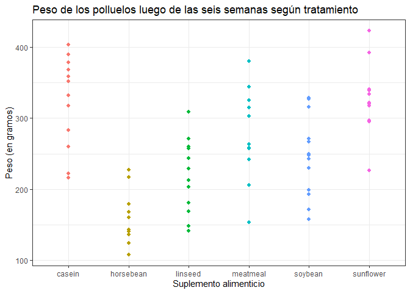

# Tarea 1
Josefina Suárez

# Tarea 1

Josefina Suárez 22/03/24

### Figura creada con código visible

``` r
library(ggplot2)
ggplot(data = chickwts) + theme_bw() + aes(x = feed, y = weight, color = feed) +
  geom_point(size = 1.9) + 
  theme(legend.position = "none") + 
  labs(x="Suplemento alimenticio", y="Peso (en gramos)",
       title = "Peso de los polluelos luego de las seis según tratamiento")
```



### Figura agregada desde un archivo

En esta sección se muestra una foto del gato más lindo de todos, y su
amiga perruna.


### Marcado de texto y escritura matemática

La Tarea 1 de PAI debe estar entregada *antes* de las **11:00 del martes
26 de marzo**.

También se muestra escritura matemática en línea,
$\sigma \sim Beta(a=3, b=2)$, y fuera de línea:
$$\sigma \sim Beta(a=3, b=2)$$

### Listas

A continuación se muestra la lista de materias optativas de la Lic. en
Estadística de la UNR que se dictan en el primer cuatrimestre de 5to
año:

1.  Bioestadística
2.  Métodos Estadísticos Aplicados a la Industria
3.  Econometría

### Tabla creada con sintaxis Markdown

| Variable | Percentil del 5% | Media  | Percentil del 95% |  Desvío  |
|:--------:|:----------------:|:------:|:-----------------:|:--------:|
|    X     |     -4.5955      | 0.1391 |      4.6110       |  2.9252  |
|    Y     |     -2.3205      | 6.0824 |      20.9370      | 7.262141 |

### Tabla creada con código de R.

    [1] 4
